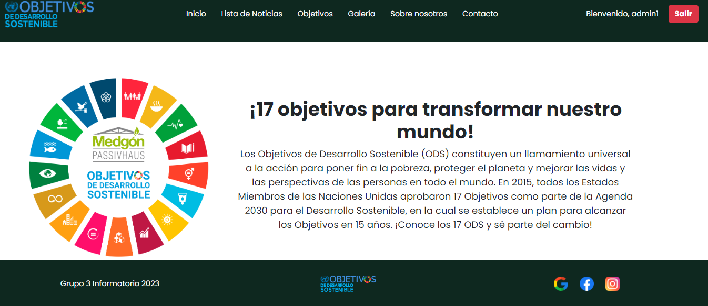
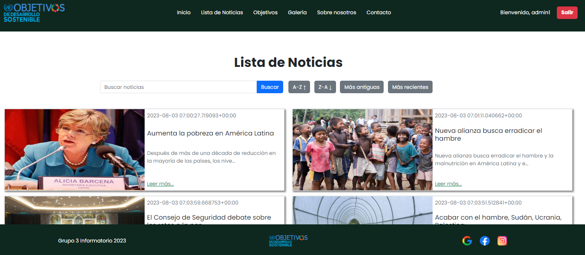
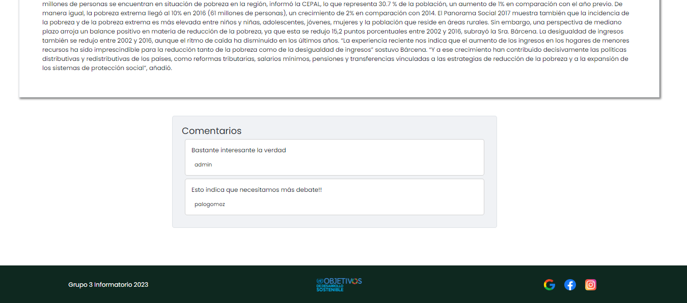
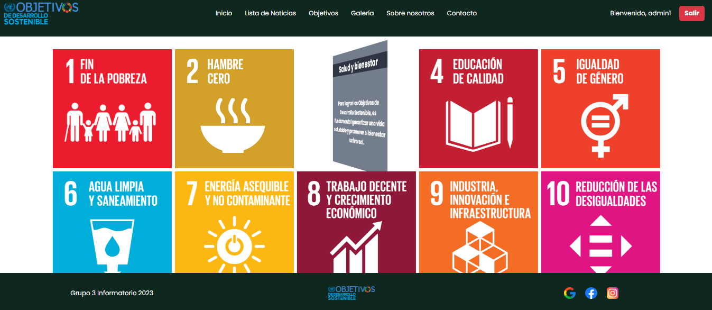
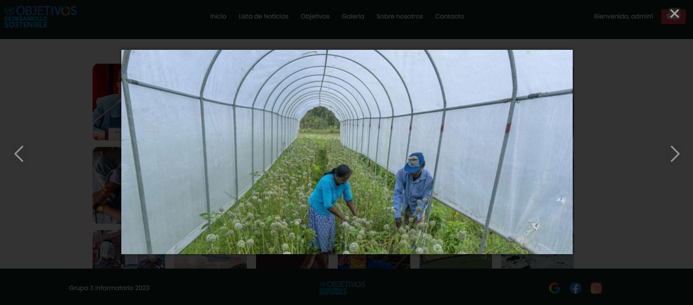
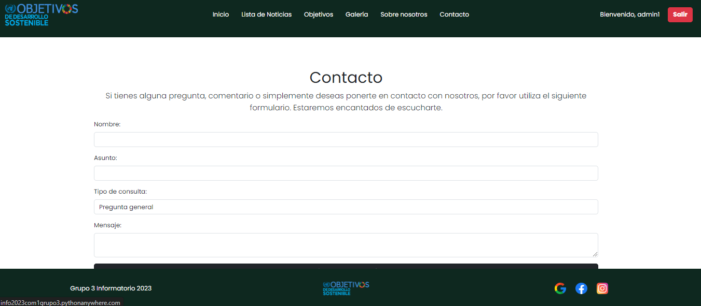

# Sustainable Development Goals Page

## Overview

Welcome to our Sustainable Development Goals (SDGs) website, dedicated to providing information and updates on the United Nations 17 Sustainable Development Goals. This README provides an overview of the various features and sections available on our platform.

## Table of Contents
- [Home Page](#home-page)
- [News List](#news-list)
- [Comments](#comments)
- [Objectives](#objectives)
- [Image Gallery](#image-gallery)
- [Contact](#contact)

## Home Page

The home page serves as the entry point, featuring a brief introduction to the SDGs and a list of the latest news related to sustainable development. Users can navigate to different sections from here.

## News List

The News List page displays cards for each news article. Users can search for articles by title and content, apply filters for recent or older articles, and sort alphabetically. Stay informed about the latest developments in sustainable development.

## Comments

The Comments section allows users to register with the Django system, post comments on news articles, add news if they are an administrator, and like comments. Engage in discussions and share your thoughts on sustainable development.

## Objectives

Explore the Objectives page to discover the 17 SDGs, which function as categories for the news articles. Click on an objective to view related news and gain insights into specific sustainable development goals.

## Image Gallery

The Image Gallery showcases all the images featured in the news articles. Browse through captivating visuals that accompany the latest news on sustainable development.

## Contact

Connect with the developers through their social media and GitHub profiles on the Contact page. Additionally, use the Contact Form to send emails and provide feedback or inquiries to the development team.